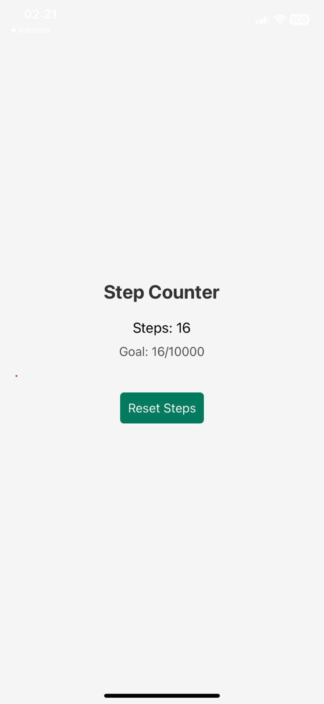
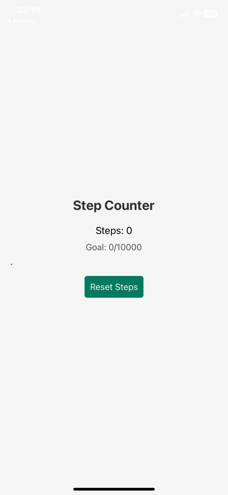

# Step Counter - React Native

A React Native Step Counter application that tracks your daily steps using device sensors and displays your progress towards a daily goal.

## Features

- **Step Counting:** Uses device sensors to track the number of steps you take.
- **Daily Goal Tracking:** Set a default daily goal and see your progress.
- **Progress Bar:** Visual representation of how close you are to your goal.
- **Reset Steps:** Reset the step count manually.
- **Simulated Steps:** For devices without sensor support, a simulation button is provided.

---

## Screenshots

### Screen




---

## Installation and Setup

1. Clone the repository:
   ```bash
   git clone https://github.com/burakfevzikar53/ReactNative-StepCounter.git
   cd step-counter
